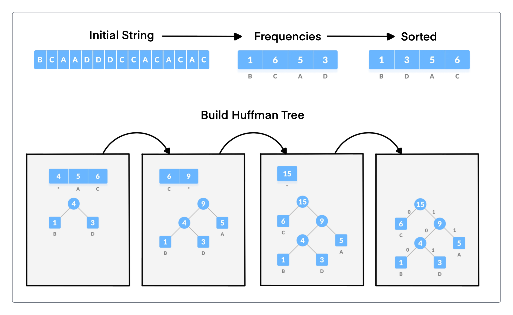

# Data Compression Techniques

This repository contains an image compressor (and decompressor) which use various data compression techniques including Huffman Coding, Chroma Subsampling, and Haar Wavelet Transformation. It also covers metrics used to assess the quality of compressed images, specifically Mean Squared Error (MSE) and Peak Signal-to-Noise Ratio (PSNR).

<p align="center">
   
</p>

## Huffman Coding

### Introduction

Huffman coding is a popular algorithm for lossless data compression. It is particularly useful for compressing data with frequently occurring characters. Huffman coding creates a tree using the frequencies of characters and then generates a unique binary code for each character. Once the data is encoded, it can be decoded using the same tree.

### How It Works

1. **Frequency Calculation**:
   Calculate the frequency of each character in the input data.

2. **Build a Priority Queue**:
   Create a priority queue where each node represents a character and its frequency. The queue helps in efficiently finding the two least frequent nodes.

3. **Build the Huffman Tree**:
   - Extract the two nodes with the smallest frequencies from the queue.
   - Create a new node with these two nodes as children and a frequency equal to the sum of their frequencies.
   - Insert the new node back into the queue.
   - Repeat until there is only one node left in the queue (this node is the root of the Huffman tree).

4. **Generate Codes**:
   Traverse the Huffman tree to assign binary codes to each character. Typically, moving left adds a '0' to the code and moving right adds a '1'.

5. **Encode the Data**:
   Replace each character in the input data with its corresponding binary code.

6. **Decode the Data**:
   Traverse the Huffman tree using the binary codes to reconstruct the original data.

<p align="center">
   
</p>

## Chroma Subsampling

### Introduction

Chroma subsampling helps in reducing the file size of images without significantly affecting visual quality, as the human eye is less sensitive to changes in color information than to changes in brightness information.

### How It Works

1. **Convert to YUV Color Space**:
   Convert the image from RGB to YUV color space.

2. **Downsample Chroma Channels**:
   Reduce the resolution of the U and V channels according to the chosen subsampling format.
   - For example, in 4:2:0 subsampling: The U and V channels are averaged for 2x2 blocks of pixels, reducing their resolution by a factor of 2 in both dimensions.

3. **Upsample Chroma Channels**:
   Restore the U and V channels to their original resolution using interpolation methods (e.g., nearest neighbor, linear interpolation).

4. **Convert Back to RGB**:
   Convert the image back from YUV to RGB color space.

<p align="center">
   
</p>

## Haar Wavelet

### Introduction

The Haar wavelet transform is a mathematical tool used for signal processing, particularly in the field of image compression. It is one of the simplest and most efficient wavelet transforms. Haar wavelet transform divides the image into approximation and detail components, enabling efficient compression by concentrating most of the image's information in the approximation part while the detail components often contain less critical information.

### How It Works

1. **Preprocess the Image**:
   Resize the image to the nearest power of 2 dimensions.

2. **Generate the Transformation Matrix**:
   Construct the matrix recursively, with each level of recursion combining and splitting image values to capture both low-frequency (approximation) and high-frequency (detail) information.

3. **Encode the Image**:
   - **Split Channels**: Split the image into its color channels (e.g., Red, Green, Blue).
   - **Apply the Transform**: Apply the Haar wavelet transform to each channel individually using matrix multiplication.
   - **Quantization**: Round the transformed values to reduce the amount of data, leading to compression.

4. **Decode the Image**:
   - **Inverse Transform**: Apply the inverse Haar wavelet transform to the encoded channels to reconstruct the original image channels using the inverse of the transformation matrix.
   - **Merge Channels**: Merge the decoded channels back together to form the full-color image.

<p align="center">
   
</p>

## Measures

### Introduction

Mean Squared Error (MSE) and Peak Signal-to-Noise Ratio (PSNR) are two widely used metrics for assessing the quality of an image, particularly when comparing a compressed (or reconstructed) image to its original counterpart.

- **MSE**: Measures the average squared difference between the original and the compressed/reconstructed image. Lower MSE indicates that the compressed/reconstructed image is more similar to the original image, while higher MSE indicates greater differences.
  
- **PSNR**: Compares the maximum possible pixel value of the image with the power of the noise (error) affecting the image. It is expressed in decibels (dB). Higher PSNR generally indicates that the compressed/reconstructed image is closer to the original, implying better quality, while lower PSNR indicates more distortion.

### Formulas

**Mean Squared Error (MSE)**:
$$\text{MSE} = \frac{1}{MN} \sum_{i=0}^{M-1} \sum_{j=0}^{N-1} \left( I(i, j) - K(i, j) \right)^2$$

Where:
- $M$ and $N$ are the dimensions of the images (height and width).
- $I(i, j)$ is the pixel value at position $(i, j)$ in the original image.
- $K(i, j)$ is the pixel value at position $(i, j)$ in the reconstructed image

**Peak Signal-to-Noise Ratio (PSNR)**:

$$\text{PSNR} = 20 \log_{10} \left( \frac{\text{MAX}_I}{\sqrt{\text{MSE}}} \right)$$

Where:
- $\text{MSE}$ is the Mean Squared Error
- $\text{MAX}_I\$ is the maximum possible pixel value of the image (e.g., 255 for an 8-bit image)

## How To Run

This section provides instructions on how to run the HCH compressor script and specifies the dependencies required.

### Dependencies

Before running the HCH compressor, ensure you have the following dependencies installed:

- Python 3.9
- NumPy 1.26.0
- OpenCV 4.9.0
- Matplotlib 3.8.4
- Bitarray 2.5.1

### Run HCH Compressor

To run the HCH compressor script, follow these steps:

1. **Navigate to the project directory**:

```shell script
cd /path/to/project
```
2. **Execute the script**:

```shell script
python madak1_compressor.py --huff --haar --yuv420 --img <image_path>
```

Arguments:
 - huff: Use Huffman coding for compression (boolean)
 - haar: Use Haar wavelet transformation for compression (boolean)
 - yuv420: Use YUV 4:2:0 chroma subsampling for compression (boolean)
 - img: Path to the input image file
 